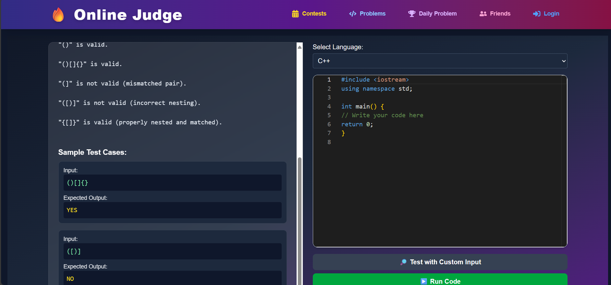

# Hack Arena - An Online Judge Platform 🧠💻

Hack Arena is a full-stack **Online Judge platform** built with the **MERN stack**, enabling users to solve coding problems, get AI-based code reviews, compete with friends, and manage problems through an admin panel.

---

## 🚀 Features

- 🔐 **JWT Authentication** for secure login/signup  
- 🧩 **Problem Management** (Admins can Create, Edit, Delete problems)  
- 🖊️ **Monaco Code Editor** with multi-language support  
- 🧠 **AI-powered Code Review & Complexity Analysis**  
- 📥 **Real-time Code Execution** using Docker sandbox  
- 📊 **Submission History** with code verdict and replays  
- 👥 **Friend System** (Search, Add, Remove friends)  
- 🛠️ **Admin Panel** with full problem control  
- 🔎 **Search/Filter Problems** by tag, difficulty, or title

---

## 🤖 AI Features (Gemini API)

- **💡 Get Hint**: Suggests a clue for the current problem  
- **🧪 Code Feedback**: Reviews logic and recommends improvements  
- **⏱ Time Complexity**: Estimates time complexity of submitted code

---

## 🖼 Demo

- 🔗 **Live**: [https://hack-arena.info](https://hack-arena.info)  
- 📹 **Demo Video**: - 📹 **Demo Video**: [Watch here](https://www.loom.com/share/511a158b3a8347c0981d1657591226ab?sid=48d6affa-cd82-48a5-b9bd-87961a15796f)


---

## ⚙ Tech Stack

| Layer         | Tech                                   |
|---------------|-----------------------------------------|
| Frontend      | React, Tailwind CSS, Vite, Axios        |
| Backend       | Node.js, Express.js                     |
| Database      | MongoDB with Mongoose                   |
| Code Runner   | Docker-based microservice on AWS EC2    |
| AI Features   | Google Gemini API                       |
| Deployment    | Vercel (Frontend), AWS EC2 + ECR (Backend & Compiler) |

---

## 📸 Screenshots

### 🧩 Problems Page


---

## 🛠 Installation & Setup

### 📦 Frontend

```bash
cd frontend
npm install
npm run dev

🔧 Backend

cd backend
npm install
node index.js

🖥 Compiler Service

cd compiler
npm install
node index.js

🔐 Environment Variables
Create .env files in backend/ and compiler/ folders:

bash
MONGO_URI=your_mongodb_uri
JWT_SECRET=your_jwt_secret
PORT=your_port


